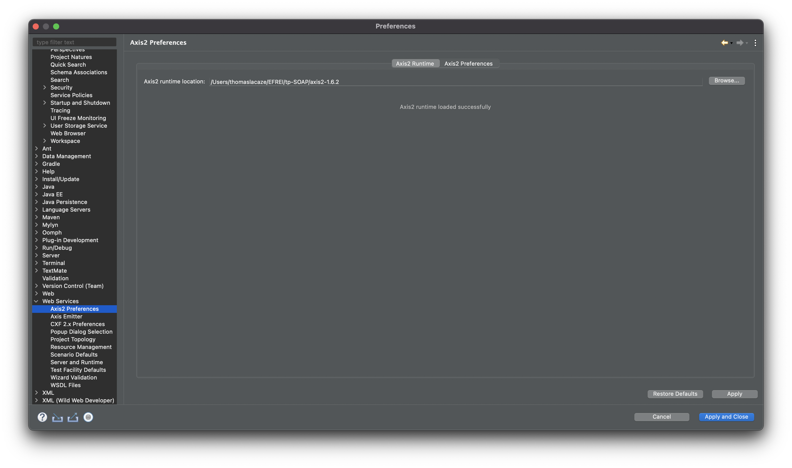

# Train booking services
Thomas LACAZE EFREI M2 DT

## Self-evaluation
| Requirements                                                                   | Grade |
| ------------------------------------------------------------------------------ | ----- |
| Create REST Train Filtering service B                                          | 6     |
| Create SOAP Train Booking service A                                            | 4     |
| Interaction between two services                                               | 4     |
| Test with Web service Client (instead of using Eclipse's Web service Explorer) | 1     |
| Work with complex data type (class, table, etc.)                               | 2     |
| Work with database (in text file, xml, in mysql, etc.)                         | 2     |
| Postman                                                                        | 2     |
| OpenAPI                                                                        | 3     |


## 🛠️ Installation Steps

### Service REST

#### 🐳 Option 1: Run from Docker run

```bash
$ docker run \
  -v /etc/localtime:/etc/localtime:ro \
  --name train-rest \
  -p 8081:8081 \
  thomaslacaze/train-rest:latest
```

[Swagger UI](http://localhost:8081/swagger/index.html)

You can launch trains generation with Swagger to fill the database. Add call `localhost:8081/trains` to see generated trains

#### 💻 Option 2: Run from source
#### Prerequisites
* Golang

1. Clone the repository
```bash
git clone https://github.com/LacazeThomas/Train-project.git
cd Train-project/WS-Train-Filtering
```
2. Run the app

```bash
$ go build -o WS-Train-Filtering && ./WS-Train-Filtering
```

### Service SOAP

#### Prerequisites

* Eclipse JEE

#### Settings
- Display server view in Eclipse JEE (Windows→Show View→Other→Servers).
- Add new server (Right click → New → Server). 
- Select the Server type (Tomcat v9.0 Server).
- Specify the installation directory.

#### Add libraries
- Right click on java web Project → Properties → Java Build Path. Select Libraries and add JAR : org.Restlet.jar


#### Edd Environment variable
- Right click on java web Project → Run as → Run Configurations... → Apache Tomcat → Tomcat v9.0 Server at localhost
- Go to environment → Add new env : DATABASE_PATH = "/PATH/soap.db" (replace /PATH/soap.db by the path of your futher the database).


#### Setting up Axis2

- Download and extract [Axis2 1.6.2](http://archive.apache.org/dist/axis/axis2/java/core/1.6.2/).
- Fill Axis2 path into your Eclipse JEE : Preferences → Web services → Axis2 Preferences.



#### Create Web Service

- Right click on the Project `WS-Train-Booking`, select Run as → Run on server. Select Choose Tomcat v9.0 -> Next
- Verify that the `Configured` tab is displayed : WS-Train-Booking. And click on finish


### Postman requests 


I used Insomnia to test the API. Insomnia is a Postman like available for REST, SOAP, GraphQL, and GRPC.
 An export is available in the repository `/Postman`. Insomnia is OpenSource and available on MacOS, Window, Ubuntu [here](https://insomnia.rest/download).

### Swagger UI

*You need to run rest container for swagger UI*
[http://localhost:8081/swagger/index.html](http://localhost:8081/swagger/index.html)

## License
<a href="https://github.com/LacazeThomas/Train-project/blob/main/LICENSE">MIT</a>